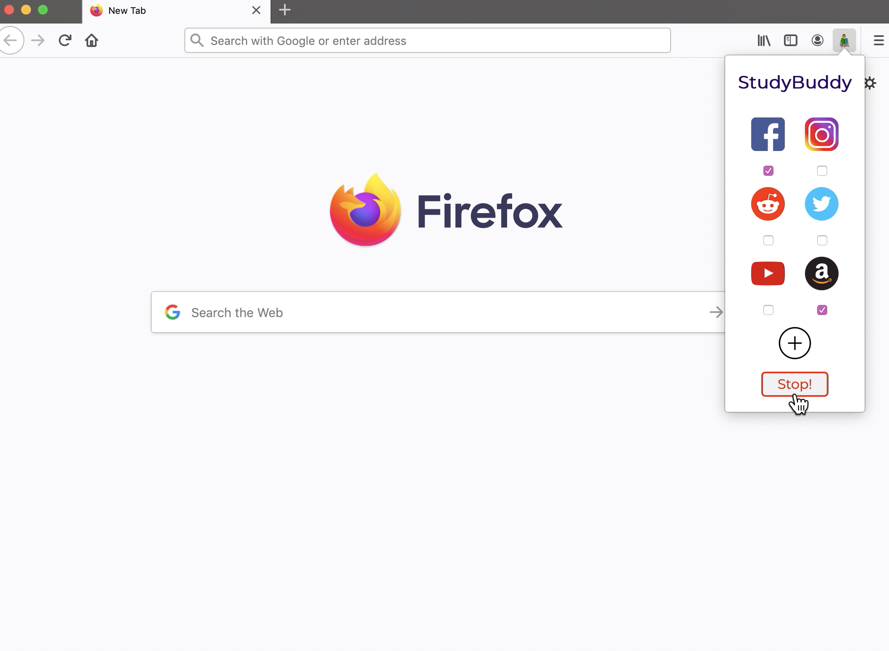
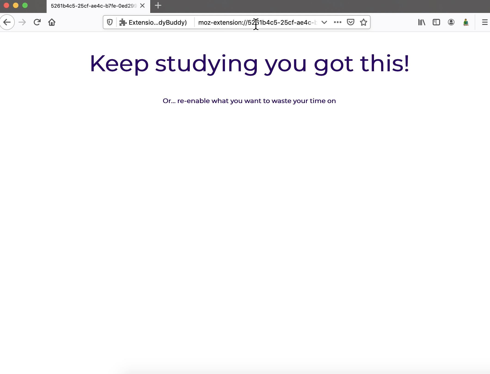

## StudyBuddy
#### Functionality
Since last week's [post](https://nyu-ossd-s20.github.io/Jen-Lopez-weekly/week02/), StudyBuddy has undergone great change in functionality. Initially, our vision was to create an extension that allowed users to set a designated study time so in this way, the extension would block sites autonomously. However, with the time crunch of having a presentable product, we ultimately decided to settle for a manual way to stop and start site blocking. Although this feature wasn't made in time for our class presentation, we still have the goal of integrating time and making it easier for our student users. Our extension project is open source, so if anyone would like to integrate this time feature can do so through a pull request. 

#### Debugging
We also managed to resolve the site-blocking issue we had last week. One of my team members, Anthony Z., took charge of the backend functionality of our extension. In other words, he used the web storage API to store sites that users wanted to block and the webRequest API, which did the site blocking. However, even when the webRequest was a blocked site, the request still went through. I set out to debug our code using console.log() statements throughout, and realized that the webRequest listener-a function that responded to web changes-only listened *once* and stopped. After further investigation, it turns out that we needed two separate JavaScript files; One file that contained DOM-related scripts and another which is solely for API scripts. Splitting the code into two separate files worked. At this point, when a user tries to access a blocked site, they are faced with a sad gray screen. Instead of seeing the gray screen, we wanted to motivate our users with an uplifting message. Next time a user visits a blocked site, the request will not only be blocked, but it will be redirected to a custom html page designed by my other teammate, Anthony S.

#### Learning Experience 
From working on this extension, I got to experience the lifecycle of a product from start to finish as well as the importance of collaboration. Most of the time, an initial vision is going to change due to constraints. In our case, we didn't have time. With collaboration, we knew that together, we had to find another way to finish our extension and ultimately, we succeeded.

Through this experience, I also learned my work preferences. As a team, we worked remotely and solely communicated via Slack. Although we still managed to have a finished product, we could have benefitted greatly if we met in person to discuss what we've done and in particular, to talk out any confusion on what our code meant. I struggled a lot when debugging the site-blocking feature, as it was my first experience with asynchronous JavaScript functions and promises. In turn, I had to read up on a lot of documentation to understand the functionality of a 5-line piece of code, valuable time that could've been used to develop the "study-time" feature. Nevertheless, I learned to read other people's code and the value of practicing proper code commenting. 

  
  

## Other Extensions
During our class presentation, there were many notable browser extensions. From an extension that changes background color based on the time of day to an extension that replaces an animal word with its image, the extensions from other groups were unique and useful to their intended audience. But, two extensions that stuck to me were [table_of_contents](https://github.com/nyu-ossd-s20/table_of_contents) and [mockbob](https://github.com/nyu-ossd-s20/mockbob). Currently, I am taking a course that has class notes in a **long** html page, making it unbearable to read. But, the table_of_contents extension would make navigating this page *manageable*. mockbob, on the other hand, I thought was the most creative and funny extension that I've seen. It would enable sarcasm to be communicated effectively via text.
