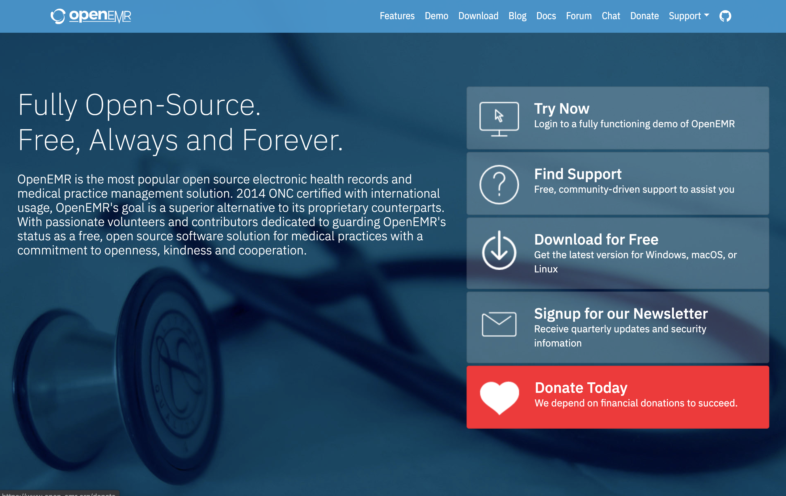

This week we had the opportunity to not only look at great examples of open source projects, but hear how involved open source software is in the financial sector. Now that we're almost halfway through the semester, we have to start thinking about what projects we'd like to contribute to. With the knowledge I gained from the Project Evaluation activity and the Open Source Talk, I am better equipped to find impactful open source projects. 

### OpenEMR
During the Project Evaluation activity, we were split off into groups and were assigned an Open Source Project to evaluate. My group evaluated [OpenEMR](https://www.open-emr.org/), an open source tool designed to manage electronic health records. In this activity, we had to figure out whether or not the project would be suitable for a beginner (like myself) to contribute to. To do that, we analyzed the website and the [project repository](https://github.com/openemr/openemr) on GitHub. The website was clear and informative, having a navigation bar with useful links such as the GitHub repository. Beyond this, what I found interesting is that OpenEMR also had a webpage that showed their product in action without having to download it. In this way, contributors would be able to interact with the project they would be contributing to before forking it. Although their website was easy to navigate, I thought it was difficult to find some documents. For instance, the contributing, license, and code of conduct files were hidden among the sea of php files. In spite of this, the required documents were well-documented and the readme also featured guidelines and information that would help a newbie. One thing I found useful was that the readme had two links for contributors: one for contributors who know their way around git and another for new contributors who want to contribute to the project, but don't know how. The project emphasizes that one does not need to be a developer to contribute. Instead, they can help translate and document pages without programming experience. 

Through this activity, I learned the importance of documenting code properly and having good naming conventions for files. The project was mostly programmed in PHP, a language I'm familiar with as I took a Web Development class last semester. But when I opened up files to look at the code, I had no idea what I was looking it. The only documentation it had were the names of the contributing authors, the license, and nothing more. Additionally, the names of the files all sounded the same so it would take a contributor *ages* to figure out its purpose. Because of this, I would personally not contribute to this project but I am glad to know that OpenEMR enforces a code of conduct- which means they care about the members of the community. Overall, this activity gave me an idea of what a good open source project looks like and the significance of documents (e.g. contributions, code of conduct, etc) for contributors.

### Bloomberg
Open Source software is everywhere. In this week's talk, we had [Kevin P. Fleming](https://www.linkedin.com/in/kpfleming/)- a member of Bloomberg's CTO office- detail how the company uses open source technology to improve the way customers make decisions. One of the products Kevin talked about was Bloomberg Terminal, a cutting-edge software that promotes transparency in the stock market. The product serves over 325,000 customers who notice peculiarities such as lagtime, even if it's for a few seconds! So, how does Bloomberg integrate Open Source into their products? 

According to Kevin, Bloomberg uses a lot of open source technology. But, it isn't necessarily because the CTO says so. Instead, technology decisions works its way from the bottom (engineers) to the top. If an engineer uses a software that resolves an issue, word starts spreading. I found this interesting because usually, individuals higher up would make decisions regarding a company's tech stack. Kevin described the open source softwares used at Bloomberg based on these categories: deploying or management, storing data (lots of it!), running and manipulating data, machine learning, and Quant Computing. One of the softwares that stuck to me was Jupyter Notebook-as I thought it was only used in classrooms. However, Bloomberg also uses it so customers are able to integrate their own python code via the Bloomberg terminal.

I've always known that any event in the world can trigger the rise and fall of the stock market. But what I found surprising was that in order to prevent important data loss during these periods, Bloomberg initiates "lockdowns". For instance, during a presidential election, the systems have to be as stable as they can to prevent data discrepancies. A lockdown essentially is a "no-deployment" period, where no one does anything to the software. This way, the software is collecting all the data it needs without anything being corrupted. 

Bloomberg's integration and collaboration in open source technologies has changed my perspective on the way companies interact with open source. There are many companies that have started open source initiatives. But not all of them are powered by open source. Open Source is important because it allows users to modify and add features they like or think is important which has a tremendous effect on user experience. By having open source at its core, Bloomberg shows its appreciation to users and its motivation to making their experience better. So far, I've only made contributions to Openstreet Map but I know that these changes are positively affecting the neighboring communities. 

