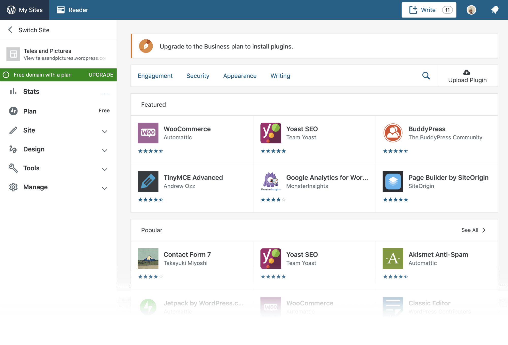

### OpenStreetMap & Calypso
To help prepare us when considering an open source project we'd collaborate on for our final project, we completed two project evaluations-one assigned and the other of our choosing. 

The first project I evaluated was [Openstreetmap](https://www.openstreetmap.org/), which is a large community-driven project that pieces together a *map of the world*. This open source project allows users to populate map data that can be used in personal projects or to inform users of features in the area. Although Google Maps already does this, there is still a lot of data missing because the Google Maps car can't go everywhere. Openstreetmap solves this issue by allowing users to contribute important data. But, even though the purpose of the project is great, I don't think that it's a good starting point for a beginner. The lack of documentation in the code, the painful installation process, and the necessary foundational knowledge on Ruby is enough to not want to contribute in code. Nevertheless, I will still continue to contribute map data in hopes that it will help another user. 

Another project I chose to evaluate was [Calypso](https://developer.wordpress.com/calypso/). This open source project from wordpress powers a single view dashboard where users can manage all their sites/applications. One of my goals for this class is to contribute to a project related to web development and luckily, Calypso is a project that is primarily built using JavaScript. An attractive feat of Calypso is the supportive community, especially for new contributors. On the [readme](https://github.com/Automattic/wp-calypso/blob/master/README.md) file in the project repository, calypso has a welcoming message for contributors: 
> "Calypso welcomes – and indeed has been built by – contributors from all walks of life, with different backgrounds, and with a wide range of experience. We're committed to doing our part to make both Calypso and the wider WordPress community welcoming to everyone."

Because of this, I would add Calypso as one of the potential projects I'd contribute to. Although I'll still look for other projects, Calypso set the bar high as how a good open source project should look like. 

