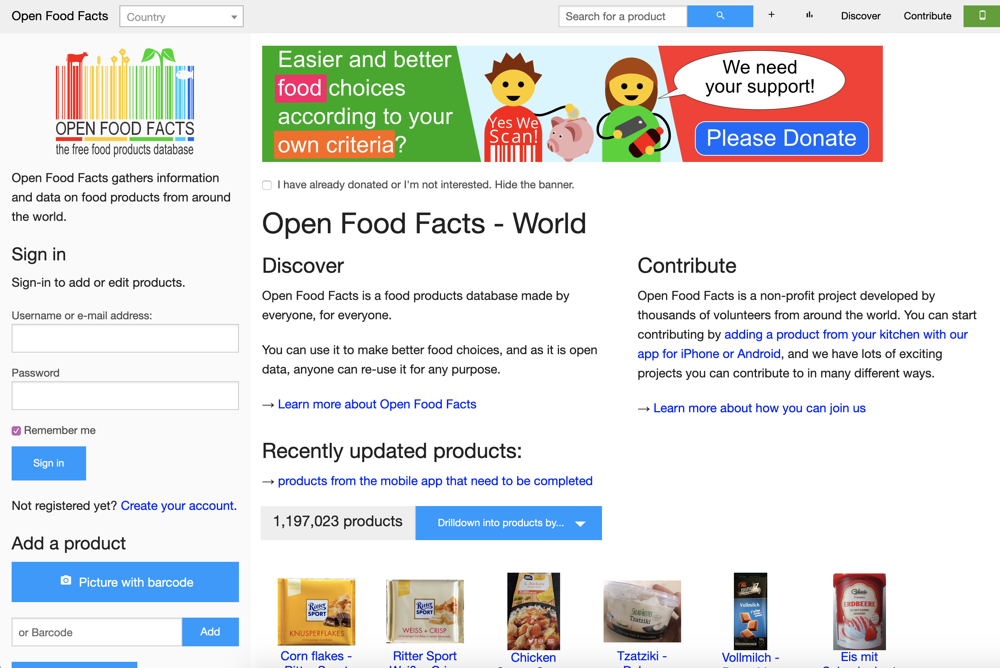

## Finalizing Project
In the last blog post, my group and I narrowed down our final project contributions to two open source projects: 
OpenFoodFacts and Tuxemon. But ultimately, after reading documentation and learning more about each project community,
we believed that OpenFoodFacts closely matched our interests. One of my goals for this class was to ultimately apply
my front-end development skills to an open source project. OpenFoodFacts, for one, is primarily built using HTML and also
features JavaScript. In other words, this is a perfect opportunity to hone in on my skills while also helping the community.
One of my group members, Lucas, has had experience with front-end languages before and sees this project as an opportunity 
to refresh his skills. My other group member, Alifa, has no experience in front-end development but sees this as a way to 
achieve one of her goals of the class- which is to learn something new. We also valued how accepting a community is to new 
contributors. After viewing interactions between individuals in issues and joining the slack channel, we noticed how welcoming
and open they are to new ideas, which is something we wanted to be a part of.

## Brainstorming Ideas
One way we want to contribute to OpenFoodFacts is to implement a new feature where tags are added to images to highlight their 
ingredient analysis (without having to go to the actual page). For instance, a few possible tags could be "Non-vegan, vegetarian, 
nut-free." We hope to open an issue and interact with community members on slack possibly this upcoming week during our next 
zoom meeting session. But since we're all new to open source, we thought it'd be best to tackle a simple open issue to get
our foot in the door. This will probably consist of fixing documentation, especially making it easier to find the code of 
conduct which is hidden in another page. We think that having it be more accessible will encourage other new contributors to 
make their first contributions.

 

