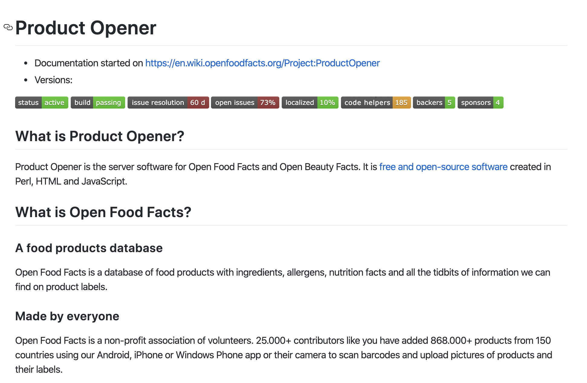

## First steps into OpenFoodFacts
This week, my group and I had a zoom session to install the development environment needed to start contributing to our project- OpenFoodFacts. However, we felt overwhelmed by the [installation guide](https://en.wiki.openfoodfacts.org/Product_Opener/Installation) provided on their website. To start contributing to the project, we need to install "Product Opener",  which is the software that is used by openfoodfacts to create and maintain its food database. But, this program required a lot of dependencies and modules (e.g. Perl) that we were unfamiliar with. My team and I spent a long time trying to dissect the guide into understandble bits but even so, we knew we were stuck. Fortunately, Openfoodfacts' slack had a channel solely dedicated to Product Opener, and in there, we were able to find another installation guide that enables contributors to install a ready-to-use development environment. Using Docker, we can use the virtual machine that has all the required modules pre-installed. This [installation guide](https://github.com/openfoodfacts/openfoodfacts-server/blob/master/docker/dev-environment-quick-start-guide.md) is a precious resource and would save new contributors time if it was linked in the readme. Despite finding this file through slack, we realized that it had been inside of a "Docker" folder within the repository the whole time. But even so, individuals unfamiliar with what docker is, like myself, would forgo looking into that folder. Therefore, we thought it'd be a great idea to create an "installation" folder within the repository that holds the docker installation guide and the regular installation guide found on the website (in a .md file) to make them more accessible to new contributors. As of today, we've been in contact with the admin via slack on ways we can contribute and have submitted an [issue](https://github.com/openfoodfacts/openfoodfacts-server/issues/3204) for the above.  

